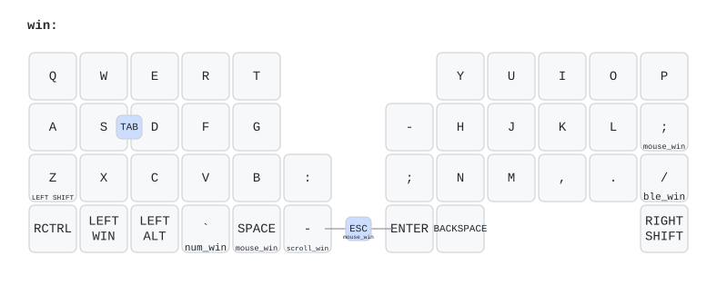
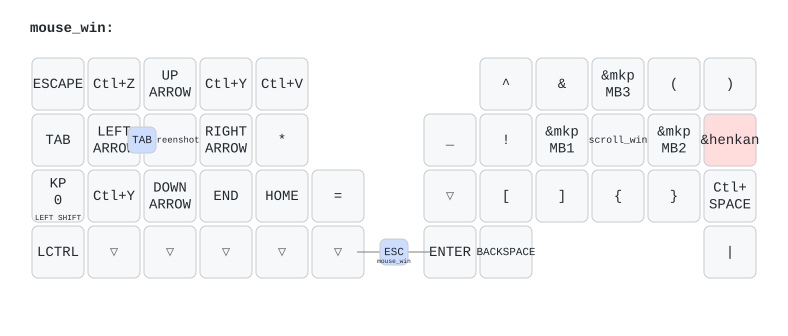
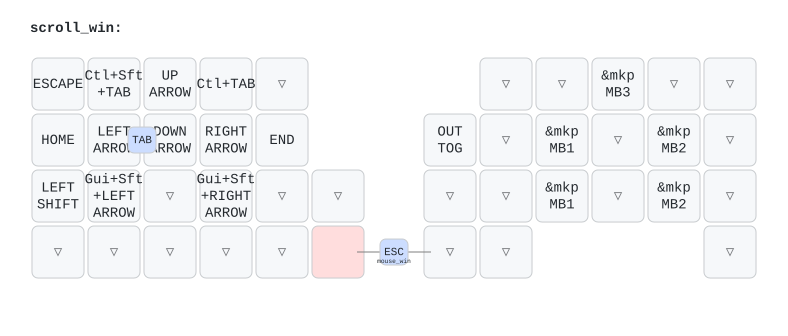
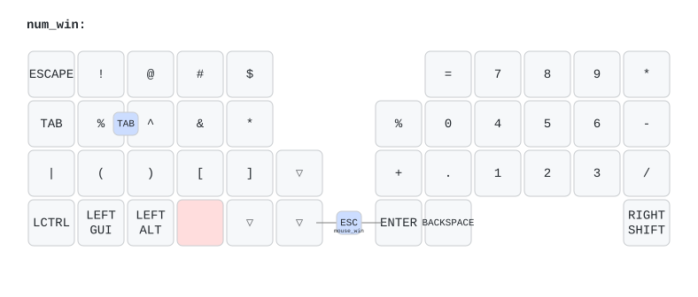
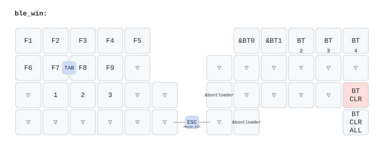

# shakupan moNa2 キーマップ視覚化

作成日: 2026-08-09  
元データ: [shakushakupanda/zmk-config-moNa2-v2](https://github.com/shakushakupanda/zmk-config-moNa2-v2) の `config/mona2.keymap`  
生成: [keymap-drawer](https://github.com/caksoylar/keymap-drawer)（再現用: [`keymap-drawer/shakupan/`](./keymap-drawer/shakupan/)）

関連:

- [shakupan-implementation-deep-dive.md](./shakupan-implementation-deep-dive.md)
- [roadmap-os-profile-layers.md](./roadmap-os-profile-layers.md)

> **注意:** これは **moNa2 / shakupan 用**の図です。Cygnus の物理配列と近いですが同一ではありません。Cygnus 実装時のキー位置マッピングは別作業です。

---

## 見方

- 分割キーボードの左右が並んで表示されます
- `h:` はホールド時の動作（レイヤーや修飾）
- マウス関連は `&mkp MB1`（左）/ `MB2`（右）/ `MB3`（中）など
- Win / Mac は**同じ物理位置**で、修飾・ショートカットのコードだけが違う対構造です

---

## レイヤー対応表

| # | 図ファイル | 名前 | 役割 |
|---|---|---|---|
| 0 | [mona2-win.svg](./keymap-drawer/shakupan/mona2-win.svg) | `win` | Windows ベース |
| 1 | [mona2-mac.svg](./keymap-drawer/shakupan/mona2-mac.svg) | `mac` | Mac ベース |
| 2 | [mona2-num_win.svg](./keymap-drawer/shakupan/mona2-num_win.svg) | `num_win` | Win 数字・記号 |
| 3 | [mona2-num_mac.svg](./keymap-drawer/shakupan/mona2-num_mac.svg) | `num_mac` | Mac 数字・記号 |
| 4 | [mona2-mouse_win.svg](./keymap-drawer/shakupan/mona2-mouse_win.svg) | `mouse_win` | Win マウス（**Cygnus で試す重点**） |
| 5 | [mona2-mouse_mac.svg](./keymap-drawer/shakupan/mona2-mouse_mac.svg) | `mouse_mac` | Mac マウス |
| 6 | [mona2-scroll_win.svg](./keymap-drawer/shakupan/mona2-scroll_win.svg) | `scroll_win` | Win ボールスクロール（**重点**） |
| 7 | [mona2-scroll_mac.svg](./keymap-drawer/shakupan/mona2-scroll_mac.svg) | `scroll_mac` | Mac ボールスクロール |
| 8 | [mona2-function_win.svg](./keymap-drawer/shakupan/mona2-function_win.svg) | `function_win` | 追加（薄い） |
| 9 | [mona2-function_mac.svg](./keymap-drawer/shakupan/mona2-function_mac.svg) | `function_mac` | 追加（薄い） |
| 10 | [mona2-ble_win.svg](./keymap-drawer/shakupan/mona2-ble_win.svg) | `ble_win` | BT / bootloader（Win） |
| 11 | [mona2-ble_mac.svg](./keymap-drawer/shakupan/mona2-ble_mac.svg) | `ble_mac` | BT / bootloader（Mac） |

全レイヤー結合: [mona2.svg](./keymap-drawer/shakupan/mona2.svg)

---

## 重点: Win 系統（まず見る）

### ベース（`win`）



入口の目安（デフォルトからのホールド）:

- Space 長押し → `mouse_win`
- 一部キー長押し → `num_win` / `scroll_win` / `ble_win`

### マウス（`mouse_win`）— Cygnus で試す候補



よく使う対応:

| 位置（QWERTY イメージ） | 動作 |
|---|---|
| **J** | 左クリック（MB1） |
| **L** | 右クリック（MB2） |
| **K** | スクロール層へホールド（`scroll_win`） |
| 上段付近 | 中クリック（MB3）など |

### スクロール（`scroll_win`）— Cygnus で試す候補



このレイヤー中、トラックボールは overlay 側 `scroller { layers = <6 7>; }` によりホイール相当になります（倍率は shakupan 実機で 1/20）。

### 数字（`num_win`）※ Cygnus ではユーザー独自を維持する層



### BLE（`ble_win`）



`BT0` / `BT1` マクロで接続先切替と Win/Mac ベース同期が行われます。

---

## Mac 系統について

Mac 側（`mac` / `mouse_mac` / `scroll_mac` 等）は **同じキー位置**で、送出コードが Gui/Cmd 寄りに差し替わっています。  
図は上表のリンクから個別に開けます。Win を理解すれば Mac は差分だけ見れば足ります。

---

## 再生成手順

```bash
# keymap-drawer 0.23+（Python 3.12+）。例: uv tool install
export PATH="$HOME/.local/bin:$PATH"

keymap parse -z /path/to/mona2.keymap -o docs/keymap-drawer/shakupan/mona2.yaml
# layout は mona2.json を参照するよう yaml を調整済みなら:
keymap draw docs/keymap-drawer/shakupan/mona2.yaml \
  -o docs/keymap-drawer/shakupan/mona2.svg

for layer in win mac num_win num_mac mouse_win mouse_mac \
             scroll_win scroll_mac function_win function_mac ble_win ble_mac; do
  keymap draw docs/keymap-drawer/shakupan/mona2.yaml -s "$layer" \
    -o "docs/keymap-drawer/shakupan/mona2-${layer}.svg"
done
```

ソース更新時は shakupan リポの最新 `mona2.keymap` を取り直してから上記を再実行してください。
